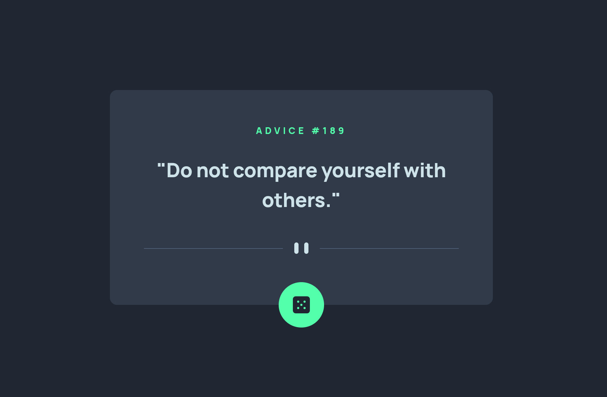

# Advice generator app solution

This is a solution to the [Advice generator app challenge on Frontend Mentor](https://www.frontendmentor.io/challenges/advice-generator-app-QdUG-13db).

## Table of contents

- [Overview](#overview)
  - [The challenge](#the-challenge)
  - [Screenshot](#screenshot)
  - [Links](#links)
- [My process](#my-process)
  - [Built with](#built-with)
  - [What I learned](#what-i-learned)
  - [Continued development](#continued-development)
  - [Useful resources](#useful-resources)
- [Author](#author)
- [Acknowledgments](#acknowledgments)

## Overview

### The challenge

Users should be able to:

- View the optimal layout for the app depending on their device's screen size
- See hover states for all interactive elements on the page
- Generate a new piece of advice by clicking the dice icon

### Screenshot



### Links

- Solution URL: [https://www.frontendmentor.io/solutions/advice-generator-app-with-react-typescript-tailwind-and-vite-ilCm2KOhHw](https://www.frontendmentor.io/solutions/advice-generator-app-with-react-typescript-tailwind-and-vite-ilCm2KOhHw)
- Live Site URL: [https://advice-generator-app-nine-ruby.vercel.app/](https://advice-generator-app-nine-ruby.vercel.app/)

## My process

### Built with

- React
- Tailwind
- Vite

### What I learned

I learned with Grok that I could handle an HTTP error within the try of the
fetch function.

```js
async function fetchData() {
  setIsLoading(true);
  try {
    const response = await fetch(API_URL);
    if (!response.ok) throw new Error(`HTTP status: ${response.status}`);
    const result = await response.json();
    setSlip(result.slip);
  } catch (error) {
    setSlip(null);
    console.log(error);
  } finally {
    setIsLoading(false);
  }
}
```

### Continued development

I need to improve using TypeScript and using async functions. This time I
relied on LLMs. I should be able to do it by myself.

### Useful resources

- [Theme Variables](https://tailwindcss.com/docs/theme#theme-variable-namespaces) -
  Setting up the colors of the theme without config, doing it directly in the css
  file with @theme. This design has few colors, but it is useful to practice
  defining the colors.
- [width](https://tailwindcss.com/docs/width#setting-both-width-and-height) - Using size-_ instead of w-_ and h-\*
- [top / right / bottom / left](https://tailwindcss.com/docs/top-right-bottom-left#basic-example) - Using inset-_ instead of top-_, left-_, right-_, bottom-\*
- [font-size](https://tailwindcss.com/docs/font-size#customizing-your-theme) - Such a great resource to customize fonts for the theme of the app
- [scale](https://tailwindcss.com/docs/scale#basic-example) - Cool and easy way to animate the active state of clicking the button

## Author

- Frontend Mentor - [@miguelzaga](https://www.frontendmentor.io/profile/miguelzaga)

## Acknowledgments

I would like to thank Anjana Vakil for her course JavaScript: From First Steps
to Professional. She explains really well async functions in it.
